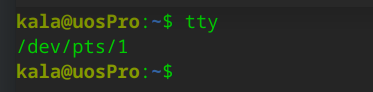
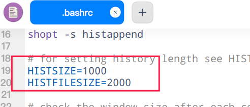

## 用户登录

### root用户

root用户是linux系统的最高管理员用户，拥有系统的几乎完整的控制权。所以，若非必要，不建议使用root用户。

### 普通用户

普通用户的权限是有限的，日常使用建议使用普通用户。当然，在统信UOS桌面版本上，默认是禁用了root用户图形界面登录系统的。


## 终端

### 什么是终端


可以把系统简单分为两个部分，一个是系统内核，另一个是用户交互界面。而终端(Terminal)就是提供用户修改系统运行逻辑的桥梁(或者理解为修改系统运行逻辑的应用程序)


### 终端分类

* 设备终端

  键盘、鼠标、显示器

* 物理终端

  路径为：`/dev/console`

  系统控制台

* 串行终端

  路径为：`/dev/ttyS#`

* 虚拟终端

  路径： `/dev/tty#`

  tty 可有n个，可以使用`Ctrl+Alt+F#`进行切换。

* 图形终端

  startx、xwindows

* 伪终端

  路径:` /dev/pts/#`

  SSH远程连接的终端

```shell
kala@uosPro:~$ tty
/dev/pts/1
```




## 交互式接口

和系统交互有两种方式：

* GUI（图形化界面）

  图形化操作，目前市场上常见的桌面环境：

  * KDE 
  * GNOME
  * XFCE
  * DDE(统信UOS的默认桌面环境)

* CLI （命令行交互方式)

  命令交互主要靠shell命令，常见的sh文件等


## SHELL

### 什么是shell

* shell是linux系统的用户界面，提供了用户于linux内核进行操作操作的接口。接受用户输入命令并发送到内核去执行。可以参考下图


* shell也被称为是linux的命令解释器
* shell是一种高级编程语言


### shell的分类

目前市面上有很多shell。但绝大多数内置的默认shell环境是`Bash`。

查看默认的shell环境

```shell
kala@uosPro:~$ echo $SHELL
/bin/bash
```

查看系统内置的所有shell环境：

```shell
kala@uosPro:~$ cat /etc/shells
# /etc/shells: valid login shells
/bin/sh
/bin/bash
/usr/bin/bash
/bin/rbash
/usr/bin/rbash
/bin/dash
/usr/bin/dash
```

切换默认shell,如比修改为比较火的zsh:

```shell
# 由于统信UOS系统没有内置zsh,需要先安装
kala@uosPro:~$ sudo apt install zsh 
# 使用 chsh 切换默认的shell
kala@uosPro:~$ chsh -s /bin/zsh 
密码：

# 输入密码后没有任何输出，查看passwd文件发现已经被更改为zsh
kala@uosPro:~$ cat /etc/passwd | grep kala
kala:x:1000:1000::/home/kala:/bin/zsh
```


## motd


连接linux系统后会有一些提示，这个可以通过`/etc/motd`进行修改。比如修改成网络比较火的`佛祖保佑，永无BUG`


将`/etc/motd`内容修改成下面的即可

```shell
/**
 *                    _ooOoo_
 *                   o8888888o
 *                   88" . "88
 *                   (| -_- |)
 *                    O\ = /O
 *                ____/`---'\____
 *              .   ' \\| |// `.
 *               / \\||| : |||// \
 *             / _||||| -:- |||||- \
 *               | | \\\ - /// | |
 *             | \_| ''\---/'' | |
 *              \ .-\__ `-` ___/-. /
 *           ___`. .' /--.--\ `. . __
 *        ."" '< `.___\_<|>_/___.' >'"".
 *       | | : `- \`.;`\ _ /`;.`/ - ` : | |
 *         \ \ `-. \_ __\ /__ _/ .-` / /
 * ======`-.____`-.___\_____/___.-`____.-'======
 *                    `=---='
 *
 * .............................................
 *          佛祖保佑             永无BUG
 */
```

## 命令提示符

命令提示符就是打开终端后的提示信息，比如我的默认显示：

`kala@uosPro:~$ `

各项及其含义

| 项     | 说明           |
| ------ | -------------- |
| kala   | 系统普通用户名 |
| @      | 连接符号       |
| uosPro | 系统主机名     |
| ~      | 主目录         |
| $      | 普通用户       |

如果最后面是`#`结尾，则表示已经进入到了`root`用户，可以使用`root`权限


### 修改命令提示符

查看当前的提示符配置:

```shell
kala@uosPro:~$ echo $PS1
\[\e]0;\u@\h: \w\a\]${debian_chroot:+($debian_chroot)}\[\033[01;32m\]\u@\h\[\033[00m\]:\[\033[01;34m\]\w\[\033[00m\]\$
```

最重要的部分是：

>[\033[01;32m\]\u@\h\[\033[00m\]:\[\033[01;34m\]\w\[\033[00m\]\$

解释说明：

- `\e` 是一个特殊的字符，表示一个颜色序列的开始。
- `\u` 表示用户名，后面可以跟着 `@` 符号。
- `\h` 表示系统的主机名。
- `\w` 表示基本目录。
- `\a` 表示活动目录。
- `$` 表示非 root 用户。
- m 表示结束附

将工作目录从绝对路径改成工作目录基名：

```shell
export PS1="\[\e]0;\u@\h: \w\a\]${debian_chroot:+($debian_chroot)}\[\033[01;32m\]\u@\h\[\033[00m\]:\[\033[01;34m\]\W\[\033[00m\]\$"
```


## 终端的颜色显示

终端的颜色显示和`echo` 命令的颜色显示通用。一共分为3个部分。

* 文字前景色(文字颜色)
* 文字背景色
* 文字的显示方式

### 前景色

| 编码 | 颜色   | 示例                             |
| ---- | ------ | -------------------------------- |
| 30   | 黑色   | echo -e "\e[30m我是黑色字体\e[m" |
| 31   | 红色   | echo -e "\e[31m我是红色字体\e[m" |
| 32   | 绿色   |                                  |
| 33   | 黄色   |                                  |
| 34   | 蓝色   |                                  |
| 35   | 品红   |                                  |
| 36   | 青色   |                                  |
| 37   | 浅灰   |                                  |
| 90   | 深灰   |                                  |
| 91   | 浅红   |                                  |
| 92   | 浅绿   |                                  |
| 93   | 浅黄   |                                  |
| 94   | 淡蓝   |                                  |
| 95   | 淡品红 |                                  |
| 96   | 淡浅绿 |                                  |
| 97   | 白色   |                                  |

### 背景色

| 颜色编码 | 表示颜色 | 示例                                    | 图片 |
| -------- | -------- | --------------------------------------- | ---- |
| 40       | 黑色     | echo -e "\e[40;31m红色字体黑色背景\e[m" |      |
| 41       | 红色     | echo -e "\e[41;37m白色字体红色背景\e[m" |      |
| 42       | 绿色     |                                         |      |
| 100      | 深灰     |                                         |      |
| 101      | 浅红     |                                         |      |

### 前景背景颜色码规律总结

前景色 30-37 深色  90-97 浅色

背景色 40-47 深色  100-107 浅色

### 文字显示方式

| 符号             | 说明 | 示例                                 |
| ---------------- | ---- | ------------------------------------ |
|                  | m    | 取消颜色设置                         |
| 粗体             | 1m   | echo -e "\e[1mBold粗体字体\e[m"      |
| 暗淡             | 2m   |                                      |
| 下划线           | 4m   | echo -e "\e[10mUnderlined下划线字体" |
| 闪烁             | 5m   |                                      |
| 隐藏(对密码有用) | 8m   |                                      |

### 组合使用

语法

```shell
echo  -e  "\e[文字显示方式;前景色;背景色\e[0m"
```

示例：

```shell
echo -e "\e[5;34;92mHello \e[1;35;40mWorld\e[m"
```


## 命令简介

在shell中，可执行的命令有两大类：

* 内部命令
* 外部命令

### 内部命令

内部命令是sh中自带的，外部命令是存储在系统中的可执行程序。

查看所有内部命令：

```shell
help
```


查询单个命令是否内部命令：

```shell
kala@uosPro:~$ type cd
cd 是 shell 内建
```

这就说明`cd` 是内部命令。

#### 启用/关闭内部命令

`enable`可以关闭和启用内部命令。查看当前所有的内部命令启用情况：

```shell
enable
```


`enable`表示已启用。

禁用内部命令：

```shell
# enable -n CMD 禁用内部命令
kala@uosPro:~$ enable -n alias

# 查看已经禁用的命令：
kala@uosPro:~$ enable -n
enable -n alias
```

禁用了再次启用：

```shell
kala@uosPro:~$ enable alias
kala@uosPro:~$ enable -n
kala@uosPro:~$ 
```

再次使用`enable  CMD` 即可启用已禁用的命令

### 外部命令

外部命令：在文件系统路径下有对应的可执行程序文件。 通常情况下位于`/usr/bin`。 

外部命令是不属于shell内建的命令，由于shell种类众多，部分超级通用的命令会另存一份外部命令以防内部命令不能调用的情况下使用。也就是说，**<font color="red">部分命令既是内部命令也是外部命令 </font>**

HASH缓存表：

系统初始hash表为空，当外部命令执行时，默认会从PATH路径下寻找该命 令，找到后会将这条命令的路径记录到hash表中，当再次使用该命令时，shell解 释器首先会查看hash表，存在将执行之，如果不存在，将会去PATH路径下寻找， 利用hash缓存表可大大提高命令的调用速率 

hash常见用法: 

```shell
hash 显示hash缓存

hash –l 显示hash缓存，可作为输入使用

hash –p path name 将命令全路径path起别名为name 

hash –t name 打印缓存中name的路径 

hash –d name 清除name缓存 

hash –r 清除缓存
```


## 命令别名

显示当前shell进程所有可用的命令别名：

```shell
kala@uosPro:~$ alias
alias ls='ls --color=auto'
```

定义别名NAME，其相当于执行命令VALUE 

```shell
alias NAME='VALUE' 
```

在命令行中定义的别名，仅对当前shell进程有效 。

如果想永久有效，要定义在配置文件中：

仅对当前用户：`~/.bashrc` 

对所有用户有效：`/etc/bashrc`

撤消别名`unalias `：

```shell
unalias [-a] name [name ...] 
```

-a 取消所有别名


## 命令行扩展

* 改变执行顺序： $() 或者 ``

  $() 和`` 优先级最高，需要先行执行。 

  例：

  ```shell
  # $() 效果， 先执行ls命令，显示当前所有文件和文件夹，然后将列出的文件/文件夹名称作为字符串输出到屏幕
  kala@uosPro:~$ echo $(ls)
  code Desktop Documents Downloads go Music node_modules package.json package-lock.json Pictures qt513 qtcode qtdesignstudio Videos VirtualBox VMs yarn.lock
  # ``效果  等同于 $()
  kala@uosPro:~$ echo `ls`
  code Desktop Documents Downloads go Music node_modules package.json package-lock.json Pictures qt513 qtcode qtdesignstudio Videos VirtualBox VMs yarn.lock
  # 不加任何字符效果， 只会将ls作为字符串输出到屏幕
  kala@uosPro:~$ echo ls
  ls
  ```

  

  

* 简化书写： {}

  打印重复字符串的简化形式。

  例：

  ```shell
  kala@uosPro:~$ echo file{1,2,3,4,5}
  file1 file2 file3 file4 file5
  ```

  

## TAB键快速输入

* TAB键命令补全

  内部命令： 

  外部命令：bash根据PATH环境变量定义的路径，自左而右在每个路径搜寻 以给定命令名命名的文件，第一次找到的命令即为要执行的命令 用户给定的字符串只有一条惟一对应的命令，直接补全 否则，再次Tab会给出列表

* TAB键路径补全

  把用户给出的字符串当做路径开头，并在其指定上级目录下搜索以指定的字 符串开头的文件名 如果惟一：则直接补全 否则：再次Tab给出列表

**总结： 如何命令或者路径太长可以输入一段之后按tab键，可以减少键盘输入，节约时间，并且十分准确！！**

## Bash快捷键

不区分大小写

| 快捷键   | 说明                                     |
| -------- | ---------------------------------------- |
| CTRL + L | 清空终端屏幕                             |
| CTRL + O | 执行当前命令，执行完后并重新显示当前命令 |
| CTRL + A | 光标移动到命令最开始，相当于HOME键       |
| CTRL + E | 光标移动到命令结尾，相当于END键          |
| CTRL + F | 光标向右移动一个字符                     |
| CTRL + B | 光标向左移动一个字符                     |
| ALT + F  | 光标向右移动一个单词尾                   |
| ALT + B  | 光标向左移动一个单词首                   |
| CTRL + U | 从光标处删除至命令行首                   |
| CTRL + K | 从光标出删除至命令行尾                   |
| CTRL + W | 从光标处向左删除至单词首                 |
| ALT + D  | 从光标处向右删除至单词尾                 |
| ALT + U  | 从光标开始，将右边的一个单词更改为大写   |
| ALT + L  | 从光标开始，将右边的一个单词更改为小写   |

## bash属性shopt

使用`shopt`命令可以查看bash支持的属性及是否开启

| 选项 | 说明                                |
| ---- | ----------------------------------- |
| -p   | 打印每个 shell 选项并标注它的状态。 |
| -s   | 开启设置                            |
| -u   | 关闭设置                            |

查看：

```shell
[kala@uosPro ~]$ shopt
autocd          off
assoc_expand_once       off

#  如果给cd内置命令的参数不是一个目录,就假设它是一个变量名,变量的值是将要转换到的目录
cdable_vars     off
# 纠正cd命令中目录名的较小拼写错误.检查的错误包括颠倒顺序的字符,遗漏的字符以及重复的字符.如果找到一处需修改之处,正确的路径将打印出,命令将继续.只用于交互式shell
cdspell         off
#[kala@uosPro ~]$ cd /ect
#bash: cd: /ect: 没有那个文件或目录
#[kala@uosPro ~]$ shopt -s cdspell
#[kala@uosPro ~]$ cd /ect
#/etc
#[kala@uosPro etc]$ 

# bash在试图执行一个命令前,先在哈希表中寻找,以确定命令是否存在.如果命令不存在,就执行正常的路径搜索
checkhash       off
checkjobs       off


# bash在每个命令后检查窗口大小,如果有必要,就更新LINES和COLUMNS的值
checkwinsize    on

# bash试图将一个多行命令的所有行保存在同一个历史项中.这是的多行命令的重新编辑更方便
cmdhist         on


compat31        off
compat32        off
compat40        off
compat41        off
compat42        off
compat43        off
compat44        off
complete_fullquote      on
direxpand       off
dirspell        off
dotglob         off
execfail        off
expand_aliases  on
extdebug        off
extglob         off
extquote        on
failglob        off
force_fignore   on
globasciiranges on
globstar        off
gnu_errfmt      off


histappend      off
histreedit      off
histverify      off


hostcomplete    on
huponexit       off
inherit_errexit off
interactive_comments    on
lastpipe        off
lithist         off
localvar_inherit        off
localvar_unset  off
login_shell     off
mailwarn        off
no_empty_cmd_completion off
nocaseglob      off
nocasematch     off
nullglob        off
progcomp        on
progcomp_alias  off
promptvars      on
restricted_shell        off
shift_verbose   off
sourcepath      on
xpg_echo        off

```

示例：

```shell
shopt -s extglob
#开启之后Shell可以另外识别出5个模式匹配操作符，能使文件匹配更加方便。
```

开启后，bash将支持以下通配符：

| 通配符     | 说明               |
| ---------- | ------------------ |
| ?(pattern) | 匹配0次或1次       |
| *(pattern) | 匹配0次以上包括0次 |
| +(pattern) | 匹配1次以上包括1次 |
| @(pattern) | 匹配1次            |
| !(pattern) | 不匹配             |

示例：

* 复制当前目录下不含.png结尾的文件到 test

```shell
$ ls 
a.png  b.png  c.d.png  index.md  test  x.jpg  y.txt
$ ls test/

$ cp !(*png) test/

$ ls test/
index.md  x.jpg  y.txt
```


## 命令行历史

保存你输入的命令历史。可以用它来重复执行命令 

登录shell时，会读取命令历史文件中记录下的命令~/.bash_history 

登录进shell后新执行的命令只会记录在缓存中；这些命令会用户退出时追加至命令历史文件中

### 重复前一条命令

* 使用上方向键，并回车执行 
*  按 !! 并回车执行 

### 其他快速使用

查看历史：

```shell
kala@uosPro:~$ history 
...
  902  cat /etc/systemd/system
  903  ls /etc/systemd/system
  904  ls /
  905  ls /usr/share/
  906  ls
  907  cd /var/log/
  908  ls
  909  type type 
  910  cat /etc/os-version 
  911  ls
  912  cd 
  913  history 
  914  cat /etc/os-release 
  915  history
```

* !string 重复前一个以“string”开头的命令 *

  ```shell
  kala@uosPro:~$ !type
  type type 
  type 是 shell 内建
  # type type 是909条命令记录
  ```

* !?string 重复前一个包含string的命令 

  ```shell
  kala@uosPro:~$ !?share
  ls /usr/share/
  accountsservice          deepin-default-settings        groff                           pam-configs
  aclocal                  deepin-defender                groovy                          pandoc
  aclocal-1.16             deepin-defender-datainterface  grub       
  # ls /usr/share 是905条命令记录
  ```

* !string:p 仅打印命令历史，而不执行 

  ```shell
  kala@uosPro:~$ !type:p
  type type 
  ```

* !$:p 打印输出 !$ （上一条命令的最后一个参数）的内容 

  ```shell
  kala@uosPro:readline$ cd /etc/systemd/system
  kala@uosPro:system$ !$:p
  /etc/systemd/system
  ```

* ^string 删除上一条命令中的第一个string 

  ```shell
  kala@uosPro:var$ cd /usr/share/cups/
  kala@uosPro:cups$ ^cups/
  cd /usr/share/
  kala@uosPro:share$ pwd
  /usr/share
  ```

* ^string1^string2 将上一条命令中的第一个string1替换为string2 

  ```shell
  kala@uosPro:share$ cd /usr/bin/
  kala@uosPro:bin$ ^bin^share
  cd /usr/share/
  kala@uosPro:share$ pwd
  /usr/share
  ```

* !:gs/string1/string2 将上一条命令中所有的string1都替换为 string2

* `CTRL R`可以搜索命令行历史

### 调用历史参数

* 要重新调用前一个命令中最后一个参数可以用` !$` 表示

  ```shell
  kala@uosPro:Desktop$ cd /home/kala/Desktop/
  kala@uosPro:Desktop$ mkdir !$a.txt
  mkdir /home/kala/Desktop/a.txt
  ```

* command !^ 利用上一个命令的第一个参数做cmd的参数 

* command !* 利用上一个命令的全部参数做cmd的参数 

* command !:n 利用上一个命令的第n个参数做cmd的参数 

* command !n:^ 调用第n条命令的第一个参数 

* command !n:$ 调用第n条命令的最后一个参数 

* command !n:m 调用第n条命令的第m个参数 

* command !n:* 调用第n条命令的所有参数

### history命令

```shell
history -ps arg [arg...] 
  选项：
      -c        删除所有条目从而清空历史列表。
      -d 偏移量 从指定位置删除历史列表。负偏移量将从历史条目末尾
                开始计数
    
      -a        将当前会话的历史行追加到历史文件中
      -n        从历史文件中读取所有未被读取的行
                并且将它们附加到历史列表
      -r        读取历史文件并将内容追加到历史列表中
      -w        将当前历史写入到历史文件中
    
      -p        对每一个 ARG 参数展开历史并显示结果，而不存储到历史列表中
      -s        以单条记录追加 ARG 到历史列表中
```

`-p`的解释说明：

```shell
kala@uosPro:Desktop$ history -c
kala@uosPro:Desktop$ history -p $(ls /home/home)
kala
kala@uosPro:Desktop$ history 
    1  history 
kala@uosPro:Desktop$ 
```

简单来说就是后续参数不记录到命令历史中


### 命令历史相关环境变量

* HISTSIZE：命令历史记录的条数

* HISTFILESIZE：命令历史文件记录历史的条数 

  

  ​	在用户的主目录下面`.bashrc`文件有此参数的定义，只针对当前用户有效。

* HISTFILE：指定历史文件，默认为~/.bash_history

* HISTTIMEFORMAT="%F %T" 显示时间 

* HISTIGNORE="str1:str2*:… " 忽略str1命令，str2开头的历史 。

  默认是没有时间的，可以使用此参数加上命令的执行时间。

  

* 控制命令历史的记录方式： 

  环境变量：HISTCONTROL 

  ​    ignoredups 默认，忽略重复的命令，连续且相同为“重复” 

  ​	ignorespace 忽略所有以空白开头的命令 

  ​	ignoreboth 相当于ignoredups, ignorespace的组合 

  ​	erasedups 删除重复命令 

* 存放在 /etc/profile 或 ~/.bashrc

  `/etc/profile`针对所有用户生效

  `~/.bashrc`针对当前用户生效


## 命令帮助

### 命令作用

如果不知道一个命令是用来干什么的：

可以用`whatis`来查看命令的介绍

```shell
kala@uosPro:Desktop$ whatis  ls
ls (1)               - list directory contents
```

如果不知道一个命令的参数有那些什么用：

内部命令可以用help。

```shell
kala@uosPro:Desktop$ whatis  ls
ls (1)               - list directory contents
 选项：
    -L      强制跟随符号链接: 在处理 `..' 之后解析 DIR 中的符号链接。
    -P      使用物理目录结构而不跟随符号链接: 在处理 `..' 之前解析 DIR 中的符号链接。
    -e      如果使用了 -P 参数，但不能成功确定当前工作目录时，返回非零的返回值。
    -@      在支持拓展属性的系统上，将一个有这些属性的文件当作有文件属性的目录。
```

### 命令具体选择使用

内置命令支持短选项

```shell
COMMAND  -h
# 或者用
man COMMAND
```

部分命令需要长选项

```shell
COMMAND --help
```


