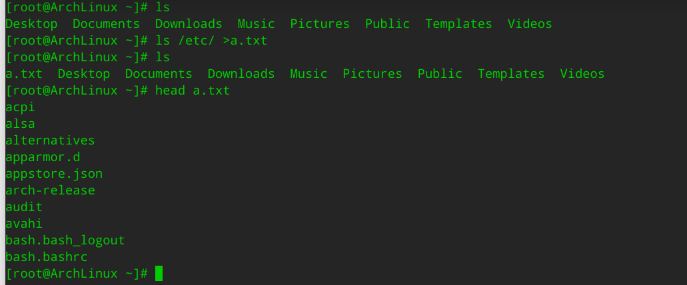

# 管道和I/O

## I/O

**I/O**（**I**nput/**O**utput），即**输入/输出**，通常指数据在内部存储器和外部存储器或其他周边设备之间的输入和输出。

### 标准输入和标准输出

linux系统给程序提供了三种输入输出设备：

* 标准输入(stdin)     用数字0表示， 默认接受来自终端窗口的输入
* 标准输出(stdout)  用数字1表示， 默认输出到终端窗口
* 标准错误(stderr)  用数字2表示，  默认输出到终端窗口

### I/O 重定向 redirect

I/O 重定向：将默认的输入，输出或错误对应的设备改变，指向新的目标

标准输出和标准错误都可以进行重定向到文件，重定向方法：

```shell
命令 重定向操作符  文件
```

操作符号有以下几种：

| 符号 | 说明                                             |
| ---- | ------------------------------------------------ |
| >    | 标准输出覆盖型重定向，会清空文件原本的内容       |
| >>   | 标准输出追加型重定向，会在原文件内容最后开始新增 |
| 2>   | 标准错误覆盖型重定向，会清空文件原本的内容       |
| 2>>  | 标准错误追加型重定向，会在原文件内容最后开始新增 |
| &>   | 所有输出覆盖型重定向到文件,会清空文件原本的内容  |
| &>>  | 所有输出追加型重定向，会在原文件内容最后开始新增 |

根据操作符号实际演示重定向：

```shell
[root@ArchLinux ~]# ls
Desktop  Documents  Downloads  Music  Pictures  Public  Templates  Videos
[root@ArchLinux ~]# ls /etc/ >a.txt
[root@ArchLinux ~]# ls
a.txt  Desktop  Documents  Downloads  Music  Pictures  Public  Templates  Videos
[root@ArchLinux ~]# head a.txt 
acpi
alsa
alternatives
apparmor.d
appstore.json
arch-release
audit
avahi
bash.bash_logout
bash.bashrc
[root@ArchLinux ~]# 
```



标准错误和标准输出分别重定向：

```shell
# 标准输入到file.out          标准错误到error.out
COMMAND > /path/to/file.out 2> /path/to/error.out
```

同时重定向输出和错误：

同时重定向输出和错误到同一个文件：`2>&1`

```shell
ls /home/kala/Desktop/aaaa.atxt  >>a.txt  2>&1
```

`2>&1` 必须要在重定向的输出后面，一般就在最后。

```shell
[kala@ArchLinux Desktop]$ ls /home/kala/Desktop/aaaa.atxt  2>&1  >>a.txt
ls: 无法访问 '/home/kala/Desktop/aaaa.atxt': 没有那个文件或目录
[kala@ArchLinux Desktop]$
```

根据上例，如果没有在重定向输出之后，就会出现标准错误依赖会按照默认输出到终端上面。其中的原因就是：

```shell
2>&1  执行到这里的时候，标准错误是功重定向到标准输出里面了，但是在这之前并没有对标准输出进行重定向。也就是按照默认的输出进行处理：在终端上面现实。

然后最后面有一个 >>a.txt  这个时候已经没有标准错误了，就只会将标准输出重定向到a.txt文件里面。
```


### 文件描述符 fd

Linux 中一切都可以看作文件，包括普通文件、链接文件、Socket 以及设备驱动等，对其进行相关操作时，都可能会创建对应的文件描述符。文件描述符（file descriptor）是内核为了高效管理对已被打开的文件所创建的索引，用于指代被打开的文件，对文件所有 I/O 操作相关的系统调用都需要通过文件描述符。


## 管道

管道（使用符号`|`表示）用来连接命令。将第一个命令的输出结果发送给第二个命令。默认只会发送标准输出，如果想要通过管道发送标准错误，可利用用`2>&1` 或 `|& `实现。


追加输出：
```shell
命令1 | tee [-a ] 文件名 | 命令2 
# 把命令1的STDOUT保存在文件中，做为命令2的输入
# -a  追加
```


