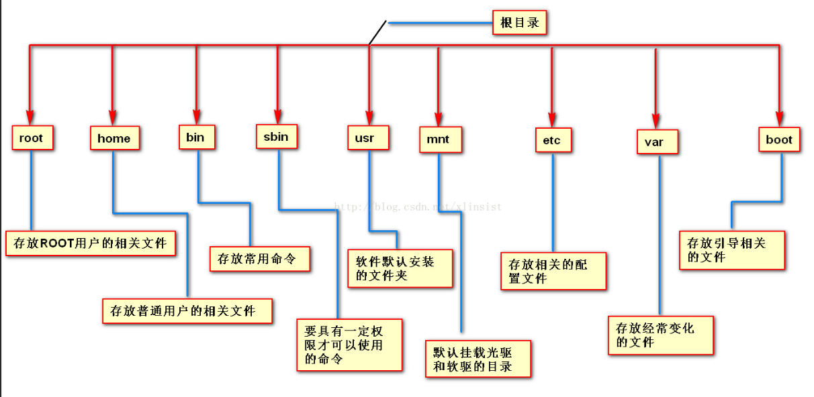
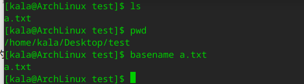
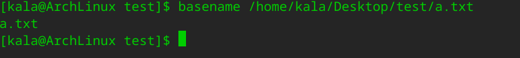
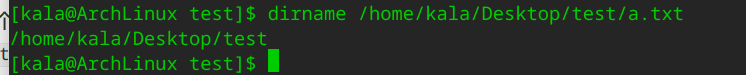
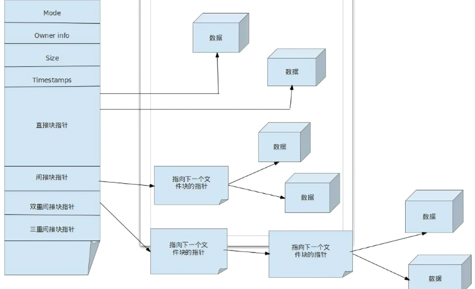
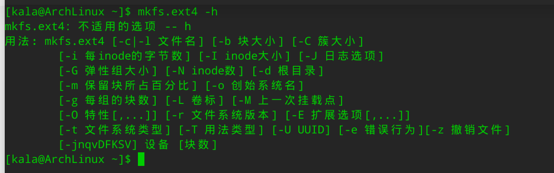
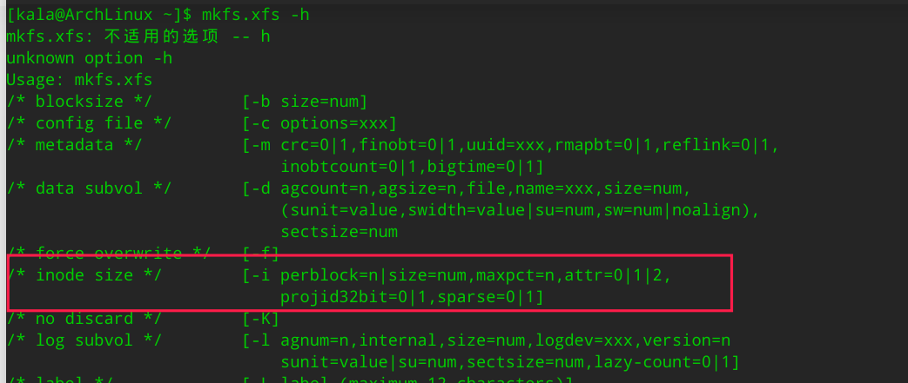
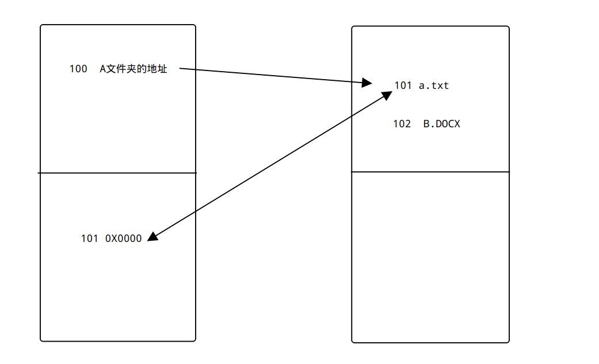

# 文件管理

## 文件系统

### 什么是文件系统


文件系统控制数据的读和写。如果没有文件系统，储存介质里的信息就会变成一块无法理解的数据。通过把数据分块、命名，不同的信息就可以被隔离、分辨。每组数据被命名为“文件”是取自纸质信息系统的命名方式。而“文件系统”是指用于管理信息的分组和命名的结构和逻辑规则。


简单来说，在操作系统中负责管理和存储文件信息的软件称为`文件管理系统`，简称文件系统。

### 文件系统的目录结构



#### 各个目录的作用

| 目录         | 作用                                                         |
| ------------ | ------------------------------------------------------------ |
| boot         | 引导文件存放目录，内核文件(vmlinuz)、引导加载器(bootloader, grub) 都存放于此目录 |
| bin          | 所有用户使用的基本命令；不能关联至独立分区，OS启动即会用到的程序 |
| sbin         | 管理类的基本命令；不能关联至独立分区，OS启动即会用到的程序   |
| lib          | 启动时程序依赖的基本共享库文件以及内核模块文件(/lib/modules) |
| lib64        | 辅助共享库文件存放位置                                       |
| etc          | 配置文件目录                                                 |
| /home/用户名 | 普通用户家目录                                               |
| root         | root用户的家目录                                             |
| media        | 便携式移动设备挂载点                                         |
| mnt          | 临时文件系统挂载点                                           |
| dev          | 设备文件及特殊文件存储位置                                   |
| opt          | 第三方应用程序以及三方程序的相关数据                         |
| srv          | 系统上运行的服务用到的数据                                   |
| tmp          | 临时文件存储位置                                             |
| usr/bin      | 保证系统拥有完整功能而提供的应用程序                         |
| usr/lib      | 32位使用                                                     |
| usr/lib64    | 只存在64位系统                                               |
| include      | c程序的头文件                                                |
| share        | 结构化独立的数据，例如doc,man                                |
| local        | 第三方应用程序的安装位置                                     |
| var/cache    | 应用程序缓存数据目录                                         |
| var/lib      | 应用程序状态数据                                             |
| var/local    | 专用于为/usr/local下的应用程序存储可变数据                   |
| var/lock     | 锁文件                                                       |
| var/log      | 日志目录及路径                                               |
| var/opt      | 为/opt下的应用程序存储可变数据                               |
| var/run      | 常用用于存储进程的pid文件                                    |
| var/spool    | 应用程序数据池                                               |
| var/tmp      | 保存系统两次重启之间产生的临时数据                           |
| proc         | 用于输出内核与进程信息相关的虚拟文件系统                     |
| sys          | 用于输出当前系统上硬件设备相关信息虚拟文件系统               |
| selinux      | selinux相关的安全策略等信息的存储位置                        |
|              |                                                              |


#### 文件系统：

* linux的文件系统是一个单根倒置树状结构。最顶层是`/` (根文件系统)，根文件系统下面有许多的用于存放不同文件的目录。
* 根文件系统用`/`表示， 通常说的`rootfs`也就是根文件系统(root  filesystem)
* 路径分隔也用`/` 。 比如根文件系统下面的`home`分区的路径就是： `/home`
* linux的设计哲学其一： 一切皆文件。所有在linux系统上，所有的东西都是用文件形态
* 文件有两种类型： 一种是数据文件，另一种是元数据文件
* linux的文件系统的设计标准： Filesystem Hierarchy Standard（FHS)文件

#### 文件管理规则

* 文件名最长255字节
* 包括路径在内文件名最长4095字节
* 除了斜杠和NUL,所有字符都有效.但使用特殊字符的目录名和文件不推荐使用， 有些字符需要用引号来引用它们 
* 标准Linux文件系统（如ext4），文件名称大小写敏感 例如：MAIL, Mail, mail, mAiL。


## linux下的文件类型

| 类型 | 说明         |
| ---- | ------------ |
| -    | 普通文件     |
| d    | 目录文件     |
| b    | 块设备       |
| c    | 字符设备     |
| l    | 符号连接文件 |
| p    | 管道文件     |
| s    | 套接字文件   |


## 绝对路径和相对路径

### 绝对路径

* 以正斜杠开始
* 完整的文件的位置路径 
* 可用于任何想指定一个文件名的时候

示例：

```shell
/home/kala/Desktop/a.txt
# 表示kala用户桌面上的a.txt文件
```

### 相对路径

* 不以斜线开始 
* 指定相对于当前工作目录或某目录的位置 
* 可以作为一个简短的形式指定一个文件名

示例：

```shell
docs/a.txt
# 表示当前路径下docs文件夹下的a.txt
```

### 基名

排除路径后的文件名，可以使用`basename`获取



在`/home/kala/Desktop/test/` 下面有一个`a.txt`文件， 用绝对路径来表示这个文件就是: `/home/kala/Desktop/test/a.txt`。 

假如有一种场景是已经获取到了这个文件的绝对路径，这里就以`/home/kala/Desktop/test/a.txt`为例，但是最终的结果是要获取到文件名：`a.txt` ，这个时候就可以使用`basename`来进行获取



### 目录名

和基名类似，获取到的只是路径，而不是文件名



## 相关命令

### 查看当前的路径

显示当前shell的工作路径：

```shell
[kala@ArchLinux test]$ pwd
/home/kala/Desktop/test
[kala@ArchLinux test]$ 

# -p -l 参数
-P 显示真实物理路径
-L 显示链接路径（默认）
```

### 更改目录

cd 改变目录,也就是change dir的意思 

使用绝对或相对路径：

```shell
 cd /home/wang/ cd home/wang
```

 切换至父目录： 

```shell
cd .. 
```

切换至当前用户主目录：

```shell
cd 
# 或者使用：
cd ~
```

切换至上次切换过来工作目录：

```shell
 cd  - 
```


### 查看目录内容

ls 列出文件和目录 ，用法：

```
ls [options] [files_or_dirs]
```

示例：

```shell
ls -a 包含隐藏文件
ls -l 显示额外的信息
ls -R 目录递归
ls -ld 目录和符号链接信息
ls -1 文件分行显示
ls –S 按从大到小排序
ls –t 按mtime排序
ls –u 配合-t选项，显示并按atime从新到旧排序
ls –U 按目录存放顺序显示
ls –X 按文件后缀排序
```


### 查看文件状态

stat 查看文件状态

三个时间戳： 

access time 访问时间，atime，读取文件内容 

modify time 修改时间,mtime，改变文件内容（数据） 

change time 改变时间, ctime，元数据发生改变

### 创建文件

touch 创建文件

使用方法：

```shell
touch [OPTION]... FILE...
```

参数

 -a 仅改变 atime和ctime 

-m 仅改变 mtime和ctime 

-t [[CC]YY]MMDDhhmm[.ss] 指定atime和mtime的时间戳 

-c 如果文件不存在，则不予创建


### 复制文件或目录

cp  复制(copy)

用法：

```shell
# 复制文件
cp 源文件1 [源文件2 源文件3...]  目标文件 
# 复制文件夹
cp -r  源文件1 [源文件2 源文件3...]  目标文件 
# c参数
-i 覆盖前提示
-n 不覆盖，注意两者顺序
-r, -R 递归复制目录及内部的所有
-u --update 只复制源比目标更新文件或目标不存在的文件
-b 目标存在，覆盖前先备份，形式为 filename~
--backup=numbered 目标存在，覆盖前先备份加数字后缀
```

### 移动或重命名

mv  移动(move )

用法：

```shell
mv  源文件   目标文件

# 常用选项：
 -i 交互式
 -f 强制
 -b 目标存在，覆盖前先备份
```


## 文件通配符

* \* 匹配零个或多个字符 
* ? 匹配任何单个字符 
* ~ 当前用户家目录 
* ~mage 用户mage家目录 
* ~+ 当前工作目录 
* ~- 前一个工作目录 
* [0-9] 匹配数字范围 
* [a-z]：字母 
* [A-Z]：字母 
* [wang] 匹配列表中的任何的一个字符 
* [^wang] 匹配列表中的所有字符以外的字符

* [:digit:]：任意数字，相当于0-9 

* [:lower:]：任意小写字母 

* \[:upper:]: 任意大写字母

* \[:alpha:]: 任意大小写字母

* \[:alnum:]：任意数字或字母 
* \[:blank:]：水平空白字符 
* \[:space:]：水平或垂直空白字符 
* \[:punct:]：标点符号 
* \[:print:]：可打印字符 
* \[:cntrl:]：控制（非打印）字符 
* \[:graph:]：图形字符 
* \[:xdigit:]：十六进制字符

通常来说`* ? ~` 这三个用的比较多，其余的较少。


## 索引节点inode

文件存储在磁盘上，磁盘的最小存储单位为扇区(sector)。系统在读取磁盘的时候，通常是几个扇区一起读取，然后从读取的几个扇区之中获取具体想要请求的数据。为了提高效率，文件在存储的时候会被分为元数据以及数据内容两部分存储。 简单来说就是一个索引和具体的数据。 当然元数据不仅仅是索引的左右，还会有其他的一些信息：

* 文件类型，权限，uid, gid
* 链接数(指向这个文件名路径名称个数)
* 该文件的大小和不同的时间戳
* 指向磁盘的文件数据块指针
* 有关文件的其他数据

根据inode表的概念，也可以总结出一个节点号是对应一个文件的，也就会出现磁盘空间还没有完全用完，但是会提示磁盘没有剩余空间创建新文件等信息(no space left)


### inode表结构



ext4的文件系统的inode表会记录文件的权限、所有者信息、大小、时间等信息。 节点表是不会记录具体的数据内容，但是会存放数据内容的地址，如果数据量比较大，记录的数据地址里面也还是会是一个数据地址，这就是间接块指针。


### inode大小

inode也是会消耗磁盘空间的，在磁盘格式化的时候会默认创建一个inode分区，专门用于存放inode信息，格式化磁盘的时候可以单独指定大小：





每个inode节点的大小，一般是128字节或256字节。inode节点的总数，在格式化时就给定，一般是每1KB或每2KB就设置一个inode。假定在一块1GB的硬盘中，每个inode节点的大小为128字节，每1KB就设置一个inode，那么inode table的大小就会达到128MB，占整块硬盘的12.8%。默认会分配1%。

### inode号

每个inode都有一个号码，操作系统用inode号码来识别不同的文件。

这里值得重复一遍，Unix/Linux系统内部不使用文件名，而使用inode号码来识别文件。对于系统来说，文件名只是让使用者来方便管理文件的别名。

表面上，用户通过文件名，打开文件。实际上，系统内部这个过程分成三步：

* 首先，系统找到这个文件名对应的inode号码
* 其次，通过inode号码，获取inode信息
* 最后，根据inode信息，找到文件数据所在的block，读出数据。

使用`ls -i`命令，可以看到文件名对应的inode号码：

```shell
[kala@ArchLinux ~]$ ls -li
总计 116
      137 drwxr-xr-x 12 kala kala  4096  5月18日 14:00 Desktop
      138 drwxr-xr-x 14 kala kala  4096  5月13日 17:13 Documents
270473472 drwxr-xr-x  9 kala kala  4096  5月18日 14:38 Downloads
276844714 drwxr-xr-x  4 kala kala    28  4月26日 09:30 go
270473473 drwxr-xr-x  3 kala kala    21  4月19日 12:57 Music
 44745330 -rw-r--r--  1 root root    49  5月12日 15:00 package.json
 44745329 -rw-r--r--  1 root root 98466  5月12日 15:00 package-lock.json
537256257 drwxr-xr-x  3 kala kala    38  5月18日 14:38 Pictures
822255872 drwxr-xr-x  2 kala kala     6  4月18日 18:12 Public
269106019 drwxr-xr-x  2 kala kala    22  5月13日 09:30 sensors
537256256 drwxr-xr-x  2 kala kala     6  4月18日 18:12 Templates
  2159777 drwxr-xr-x  2 kala kala     6  5月12日 16:08 test
822255873 drwxr-xr-x  4 kala kala    43  4月19日 09:28 Videos
269112971 drwxr-xr-x  9 kala kala    98  5月17日 17:41 virtualbox
# 最前面的数字就是inode号
```

### 文件夹

对于文件夹来说，文件夹也有一个inode号，同时也会有目录的数据块，目录的数据块存储的就是每个文件的inode号以及文件名。 同时每个文件也会有单独的inode号，这两个会关联起来。



### 复制/删除/移动与inode

#### cp与inode

分配一个空闲的inode号，inode表中生成新条目。 然后在目录中创建一个目录项，将名称与inode编号关联，并拷贝复制数据

#### rm与inode

链接数递减，inode号被释放。数据内容不会马上被删除，其他文件需要使用数据块的时候会覆盖。

#### mv与inode

用新的文件名创建对应新的目录项
删除旧目录条目对应的旧的文件名
不影响inode表（除时间戳）或磁盘上的数据位置，实际上没有数据被移动


## 链接link

连接分为两种： 硬连接和软连接。

### 硬连接

硬连接就是多个文件名指向同一个文件，inode号相同。硬连接的作用就是允许一个文件有多个有效路径，删除其中一个硬链接文件并不影响其他有相同 inode 号的文件，防止误删源数据。

创建硬连接：

```shell
ln  文件    连接文件
```

创建硬连接的时候会增加额外的记录项引用文件，也就是inode号会增加，但是真正的数据不会增加，文件的连接数会增加。且硬连接不能跨驱动器或者分区。

删除硬连接或者源文件的时候是会影响源数据的，如果源文件的连接少于1就会将源文件删除。


### 符号连接软连接

软链接（也叫符号链接），类似于windows系统中的快捷方式，与硬链接不同，软链接就是一个普通文件，只是数据块内容有点特殊，文件用户数据块中存放的内容是另一文件的路径名的指向，而不是存储的真正的数据。

软软链接作用：

* 便于文件的管理，比如把一个复杂路径下的文件链接到一个简单路径下方便用户访问。

* 节省空间解决空间不足问题，某个文件系统空间已经用完了，但是现在必须在该文件系统下创建一个新的目录并存储大量的文件，那么可以把另一个剩余空间较多的文件系统中的目录链接到该文件系统中。


删除软链接并不影响被指向的文件，但若被指向的原文件被删除，则相关软连接就变成了死链接。


### 两种连接的区别

硬链接：

* 硬链接，以文件副本的形式存在。但不占用实际空间。
* 不允许给目录创建硬链接。
* 硬链接只有在同一个文件系统中才能创建。
* 删除其中一个硬链接文件并不影响其他有相同 inode 号的文件。

软链接：

* 软链接是存放另一个文件的路径的形式存在。
* 软链接可以跨文件系统 ，硬链接不可以。
* 软链接可以对一个不存在的文件名进行链接，硬链接必须要有源文件。
* 软链接可以对目录进行链接。


