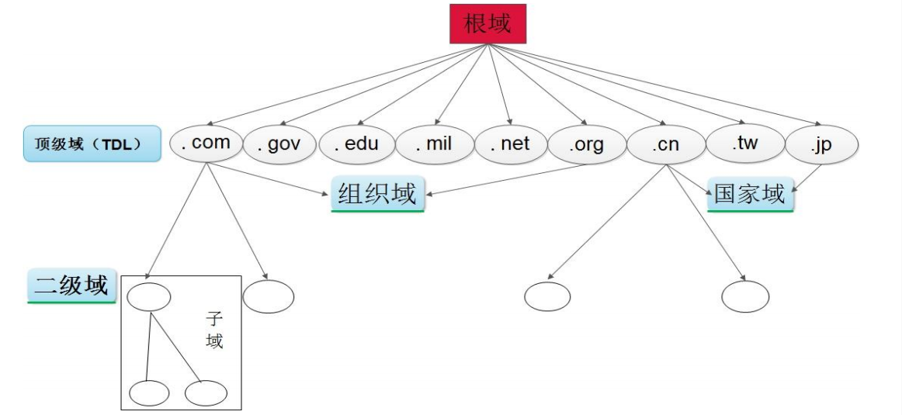

# DNS

## DNS简介

* 什么是DNS

  DNS（Domain Name System，域名系统），因特网上作为域名和IP地址互相映射的一个分布式数据库，能够使用户更方便的访问互联网，而不用去记住能够被机器直接读取的IP数串。通过主机名，最终得到该主机对应的IP地址的过程叫做域名解析（或主机名解析）。

* 网络协议

  DNS默认是运行在TCP/53以及UDCP/53上

* DNS系统的作用

  正向解析：根据主机名称（域名）查找对应的IP地址

  反向解析：根据IP地址查找对应的主机域名

* BIND

  BIND（Berkeley Internet Name Domain(伯克利因特网名称域系统）是一款可以运行在Linux系统上的域名解析系统。具备完整的DNS功能。

* /etc/hosts

  早期电脑实现ip域名解析的一种方式，优先级最高。
  
* DNS服务器类型

  * 主DNS服务器

    管理和维护所负责解析的域内解析库的服务器

  * 从DNS服务器

    从主服务器或从服务器“复制”（区域传输）解析库副本

  * 缓存DNS服务器

  


## DNS域名

* 分类

  * 根域

  * 一级域名

  * 二级域名

  * 三级域名

    ...

  * 最多127级

* 结构

  跟linux的文件系统类似，如下图

  

* 查询类型

  * 递归查询
  * 迭代查询

* 名称服务器

  域内负责解析本域内的名称的主机。根服务器：13组服务器

* 解析类型

  * FQDN --> IP

  * IP --> FQDN

  正反向解析是两个不同的名称空间，是两棵不同的解析树


## DNS域名解析大致流程

首先是客户端查询本机是否有记录(浏览器缓存、/etc/hosts文件) --> DNS服务器 本地缓存-->  DNS服务器发起迭代请求 --> 。。。.-->最后返回客户端


## 资源记录

资源记录语法

```shell
name [TTL] IN rr_type value
TTL 可全局继承
@可用于引用当前区域的名字
```

SOA：Start Of Authority，起始授权记录；一个区域解析库有且仅能有一个SOA记录，必须位于解析库的第一条记录。

| 记录类型 | 说明                                 |
| -------- | ------------------------------------ |
| A        | IPV4地址                             |
| AAAA     | IPV6地址                             |
| PTR      | IP转域名                             |
| NS       | name server  标明当前区域的DNS服务器 |
| CNAME    | 别名记录                             |
| MX       | 邮件                                 |
| TXT      | 通常做反垃圾邮件                     |


## BIND

### 只缓存DNS服务器

安装

```shell
dnf install bind -y
```

修改/etc/named.conf

```shell
#       listen-on port 53 { 127.0.0.1; };
# 修改下方示例：   localhost 表示监听本机所有地址
        listen-on port 53 { localhost; };

#       allow-query     { localhost; };
# 将localhost修改成any其他机器即可通过当前DNS进行域名查询
        allow-query     { any; };
```


启动服务

```shell
systemctl  start  named
```

其他机器验证

```shell
[root@rocky9 ~]# ping www.baidu.com
PING www.a.shifen.com (183.232.231.172) 56(84) bytes of data.
```

再次将网络断开，再次尝试ping www.baidu.com发现依然可以解析出ip地址，这就是DNS服务器会做缓存。

### 主DNS服务器


